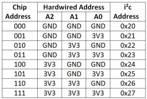

# `mcp23017`

> no_std driver for [MCP23017](http://ww1.microchip.com/downloads/en/DeviceDoc/20001952C.pdf) (16-Bit I2C I/O Expander with Serial Interface module)

[](https://travis-ci.org/lucazulian/mcp23017)
[](https://crates.io/crates/mcp23017)

## Basic usage

Include this [library](https://crates.io/crates/mcp23017) as a dependency in your `Cargo.toml`:

```rust
[dependencies.mcp23017]
version = "<version>"
```
Use [embedded-hal](https://github.com/rust-embedded/embedded-hal) implementation to get I2C handle and then create mcp23017 handle:

```rust
extern crate mcp23017;

match mcp23017::MCP23017::default(i2c) {
    Ok(mut u) => {
        u.init_hardware();
        u.pin_mode(1, mcp23017::PinMode::OUTPUT);   // for the first pin
        u.all_pin_mode(mcp23017::PinMode::OUTPUT);  // or for all pins

        let status = u.read_gpioab().unwrap();
        println!("all {:#?}", status).unwrap();

        let read_a = u.read_gpio(mcp23017::Port::GPIOA).unwrap();
        println!("port a {:#?}", read_a).unwrap();

        match u.write_gpioab(65503){
            Ok(_) => {
                println!("ok").unwrap();
            }
            _ => {
                println!("something wrong").unwrap();
            }
        }
    }
    Err(mcp23017::MCP23017::Error::BusError(error)) => {
        println!("{:#?}", error).unwrap();;
        panic!();
    }
    _ => {
        panic!();
    }
};
```

### Hardware address pins


## Documentation

API Docs available on [docs.rs](https://docs.rs/mcp23017/0.1.0/mcp23017/)

## License

[MIT license](http://opensource.org/licenses/MIT)
